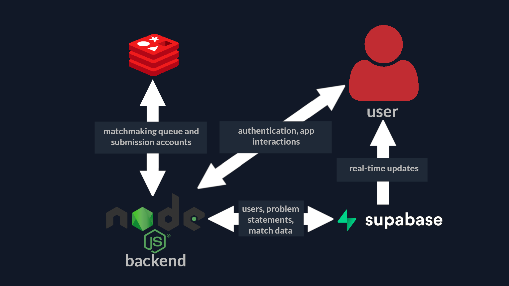

# Duelvsme (name WIP)
An open source competitive programming ***lockout*** web alternative to the Discord bot, with matchmaking and additional game modes.
## How to get started:
1 - Clone the repo using git or manually download it:
```sh
git clone https://github.com/AbdelH2O/duelvsme
```
2 - Install dependencies:
```sh
npm install
```
or
```sh
yarn install
```
3 - Setup your environment variables, Supabase and Redis infrastructure (see down below)

4 - Start the app:
```sh
npm run start
```
or
```sh
yarn start
```

# Backend Architecture
Here's an overview of how the different components in interact with each other to make the app work. (I didn't include the background worker but it would be situated between Redis and the node server)

## Supabase Schema

## Redis Data:
The Redis server holds the following important information:

* Codeforces accounts used to submit the code. (create a set called `accounts` and under which the accounts are added in the following format: `email;password`)
* All the problems indexed by their rating (create a set with each rating and add problems to it as a stringified [`Problem` object](https://codeforces.com/apiHelp/objects#Problem))

# Contributing
Contributions are what makes the open source community such an amazing place to learn, inspire, and create. Any contributions you make are **greatly appreciated**.

If you have a suggestion that would make this better, please fork the repo and create a pull request. You can also simply open an issue with the tag "enhancement".
Don't forget to give the project a star! Thanks again!

1. Fork the Project
2. Create your Feature Branch (`git checkout -b feature/AmazingFeature`)
3. Commit your changes (`git commit -m 'Add some AmazingFeature'`)
4. Push to the Branch (`git push origin feature/AmazingFeature`)
5. Open a Pull Request

# Built with
[![Svelte][Svelte.dev]][Svelte-url]

[![Redis][Redis.com]][Redis-url]

[![Supabase][Supabase.com]][Supabase-url]

[![Tailwind][Tailwindui.com]][Tailwind-url]

# Contact
Abderrahmane Hana [a.hana@aui.ma](mail:a.hana@aui.ma)

Project link: https://github.com/AbdelH2O/duelvsme

# Acknowledgments
* Big thanks to [pilcrowOnPaper](https://github.com/pilcrowOnPaper) for his amazing library [Lucia-sveltekit](https://github.com/pilcrowOnPaper/lucia-sveltekit).

[Svelte-url]: https://svelte.dev/
[Svelte.dev]: https://img.shields.io/badge/Svelte-4A4A55?style=for-the-badge&logo=svelte&logoColor=FF3E00
[Redis-url]: https://redis.com/
[Redis.com]: https://img.shields.io/badge/redis-%23DD0031.svg?style=for-the-badge&logo=redis&logoColor=white
[Supabase-url]: https://supabase.com/
[Supabase.com]: https://img.shields.io/badge/Supabase-3ECF8E?style=for-the-badge&logo=supabase&logoColor=white
[Tailwind-url]: https://tailwindui.com/
[Tailwindui.com]: https://img.shields.io/badge/tailwindcss-%2338B2AC.svg?style=for-the-badge&logo=tailwind-css&logoColor=white
